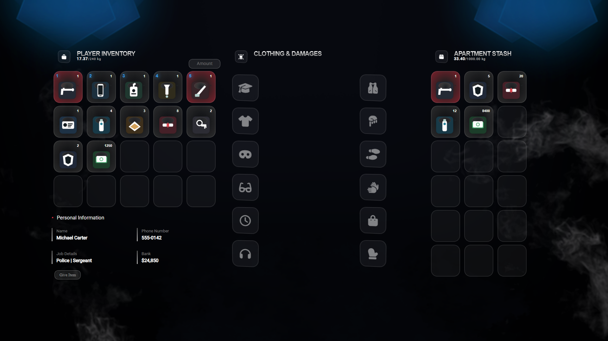

# QBCore Inventory

Newest QBCore inventory for your FiveM server. Custom UI with clothing slots, personal info, hotbar, stashes, and drops.



## Tags

`qbcore` `fivem`

## Features

- Item crafting
- Weapon attachment crafting
- Stashes (personal and shared)
- Vehicle trunk and glovebox
- Weapon serial numbers
- Shops
- Item drops
- Clothing panel
- Player info (name, phone, job, bank)

## Requirements

- [qb-core](https://github.com/qbcore-framework/qb-core)
- [oxmysql](https://github.com/overextended/oxmysql)

## Installation

1. Download this resource and put it in your `[qb]` folder:

```
resources/[qb]/qb-inventory
```

Keep the folder name as `qb-inventory`.

2. Remove any other inventory resource (`lj-inventory`, `ox_inventory`, `qs-inventory`, or an older `qb-inventory`).

3. Add this to `server.cfg` after `oxmysql` and `qb-core`:

```
ensure oxmysql
ensure qb-core
ensure qb-inventory
```

4. Restart the server.

5. In-game, press `TAB` to open inventory and `Z` to open the hotbar.

## Configuration

Open `config.lua` to change:

- Open inventory key (`Config.OpenInventory`)
- Hotbar key (`Config.OpenHotbar`)
- Max weight and slots
- Drop cleanup time
- Backpack animation
- Webhooks

Locale strings are in `locales/en.lua`.

Join Discord: https://discord.gg/qbcoreframework
